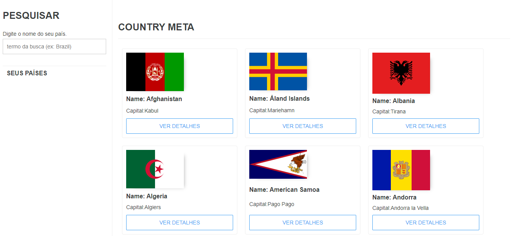
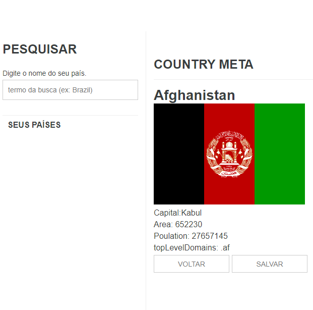
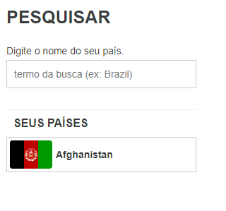
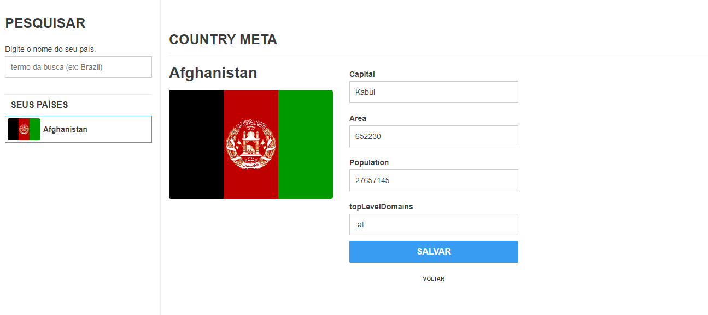

# Meta Countries
Este projeto foi desenvolvido para o teste técnico da empresa Meta.
### Principais tecnologias utilizadas:
 - ReactJS
 - GraphQL
 - Redux
 - Styled Components

 ### Primeiro Passo
 Baixe o repositório em sua máquina utilizando o comando
 ```
 git clone https://github.com/douglaspujol/metacountries.git
 ```
 Na raiz do projeto, execute o comando "yarn" para baixar todas as dependências.
 ```
yarn
 ```
Depois de finalizar todos os downloads, execute yarn start para rodar localmente o seu projeto.
 ```
yarn start
 ```
Seu projeto estará rodando na URL http://localhost:3000/

---
## Telas.
São objetivos do desafio:
- Criar uma lista de cards para exibir os países mostrando a bandeira, o nome e a capital dele; - Possibilite o usuário buscar países;

- Na lista, o usuário pode ir para a página de detalhes do país e ver uma lista mais completa de informações (bandeira, nome, capital, área, população e top-level domain);




- Criar um formulário para editar os dados de um país (salvando apenas no client-side);



Para mais informações. Assita o vídeo no Youtube onde explico todas as funcionalidades e futuras features do projeto.<br>
https://youtu.be/oSMjSc1lOI0
<br>
Muito Obrigado
